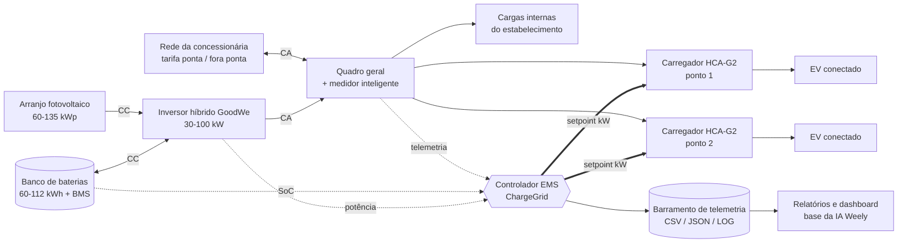
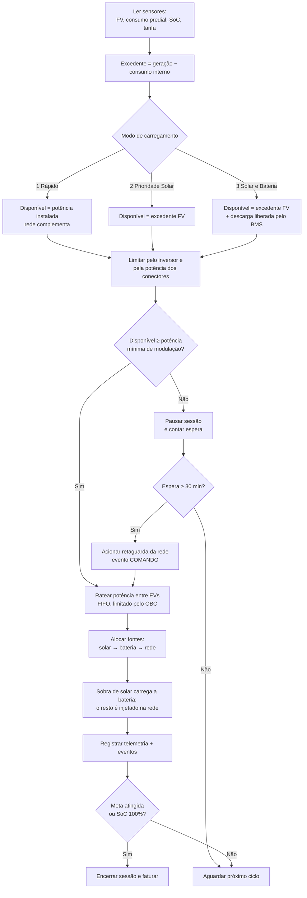
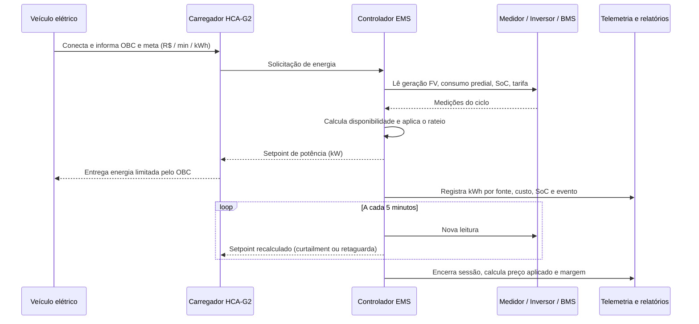

# ChargeGrid Intelligence — Eletroposto Inteligente GoodWe

**Protótipo funcional de gestão energética, automação e monetização de recarga veicular**
*Sprint 3 — Prototipagem Funcional e Integração*

---

## Equipe

| Nome | RM | 
|------|----|
| André Santos de Azevedo | RM572236 |
| Bruno Menezes Monegatto | RM570311 | 
| Fabiana Yumi Rodrigues Nakagawa | RM571249 | 
| Iago Neiva Gorrão | RM570234 |
| João Pedro Amorim Albuquerque | RM573342 |
| Kayky Araujo Silva | RM569535 |

> Substitua a tabela acima pelos integrantes do grupo antes da entrega.

---

## 1. Visão geral

O simulador reproduz, de ponta a ponta, a operação de um eletroposto comercial que integra
**geração fotovoltaica, armazenamento em baterias, inversor híbrido GoodWe, medição inteligente,
carregadores da Linha HCA-G2 e um controlador EMS** que toma decisões automáticas a cada 5 minutos.

O protótipo é **simulado em software**, mas cada componente foi modelado como um driver isolado:
substituir a função de leitura simulada pela leitura Modbus/API real do equipamento coloca o mesmo
código em campo, sem alterar o EMS nem os relatórios.

O que o sistema demonstra em execução:

- leitura contínua de sensores (geração FV, consumo predial, SoC da bateria, tarifa vigente);
- **comandos automatizados** de despacho de potência (setpoint dos carregadores) emitidos pelo EMS;
- **balanceamento dinâmico** entre múltiplos pontos de recarga;
- rastreio da **origem de cada kWh** entregue (solar direta, bateria ou rede);
- precificação dinâmica por faixa horária e tarifa de ponta da concessionária;
- coleta de telemetria e **exportação dos dados** em CSV/JSON/LOG;
- relatórios operacional, energético, financeiro, de sustentabilidade e de automação.

---

## 2. Esquema de integração dos componentes

### 2.1 Diagrama de blocos



### 2.2 Fluxograma da lógica de decisão (executada a cada 5 minutos)



### 2.3 Sequência de uma sessão de recarga



---

## 3. Como executar

Requisito: **Python 3.8+** (somente biblioteca padrão, sem dependências externas).

```bash
# execução interativa completa (configuração passo a passo)
python3 "Programa de Recarga GoodWe.py"

# demonstração automática — usada na gravação do vídeo técnico
python3 "Programa de Recarga GoodWe.py" --auto --seed 21

# execução reproduzível com pasta de saída específica
python3 "Programa de Recarga GoodWe.py" --auto --seed 21 --saida dados_exemplo
```

| Parâmetro | Função |
|-----------|--------|
| `--auto` | Carrega o perfil de demonstração e dispensa a digitação |
| `--seed N` | Fixa a semente aleatória, tornando a simulação 100% reproduzível |
| `--rapido` | Remove as pausas de tela (testes e gravação) |
| `--saida PASTA` | Define onde os dados coletados serão gravados (padrão `saidas/`) |
| `--sem-exportar` | Executa sem gerar arquivos |

### Arquivos gerados a cada execução

| Arquivo | Conteúdo |
|---------|----------|
| `sessoes_*.csv` | Uma linha por sessão: EV, SoC, meta, kWh por fonte, custo, preço, receita |
| `telemetria_*.csv` | Uma linha a cada 5 min: FV, consumo, recarga, rede, SoC, setpoint, tarifa |
| `eventos_*.log` | Todos os comandos automatizados emitidos pelo EMS, BMS e carregadores |
| `resumo_*.json` | Configuração + indicadores consolidados (formato pronto para dashboard/API) |

A pasta [`dados_exemplo/`](dados_exemplo) contém uma execução completa e reproduzível
(`--auto --seed 21`), incluindo a saída integral do console em `execucao_demonstracao.txt`.

---

## 4. Justificativa técnica das escolhas

| Escolha | Justificativa |
|---------|---------------|
| **Carregadores GoodWe Linha HCA-G2 (7 / 11 / 22 kW)** | Cada modelo define, além da potência, o tipo de rede (mono 230 V ou tri 400 V) e a potência mínima de modulação (1,4 kW / 4,2 kW). Esses limites são a razão física das pausas e retomadas de sessão observadas na simulação. |
| **Inversor híbrido + banco de baterias** | O inversor híbrido é o único componente capaz de somar, no mesmo barramento CA, geração FV, banco de baterias e rede. Sem ele, o modo "Solar e Bateria" não existiria — a potência de recarga cairia a zero em cada nuvem. |
| **Medidor inteligente no quadro geral** | Garante a prioridade das cargas internas: o EMS só oferece aos carregadores o que sobra da operação do estabelecimento, evitando ultrapassar a demanda contratada. |
| **Controlador EMS com passo de 5 minutos** | Resolução suficiente para acompanhar a variação da irradiância e a chegada de veículos, e compatível com o tempo de resposta real de wallboxes comerciais. |
| **Rateio FIFO limitado pelo OBC** | O carregador de bordo do veículo (3,7 a 22 kW) é sempre o limite superior real. Ignorar esse limite superestimaria a energia entregue e falsearia o faturamento. |
| **Ordem de despacho solar → bateria → rede** | Maximiza o autoconsumo, protege o SoC mínimo do banco (20%) e deixa a rede como último recurso — exatamente a hierarquia que produz o menor custo por kWh. |
| **Regra de retaguarda (30 min)** | Sustentabilidade não pode custar a experiência do cliente: se o EV fica sem energia renovável por 30 minutos, o EMS libera a rede e registra o comando no log, tornando a decisão auditável. |
| **Tarifa de ponta (18h–21h) na compra** | Permite medir a margem real da operação, e não apenas a receita: recarregar na ponta custa R$ 1,45/kWh contra R$ 0,85/kWh fora dela. |
| **Precificação por faixa horária (multiplicador)** | Reproduz a estratégia comercial de deslocar demanda para os horários de maior geração solar. |
| **Python com biblioteca padrão** | Executa em qualquer máquina da banca sem instalação, o que era requisito para a demonstração ao vivo. A modelagem em funções por componente mantém o caminho aberto para a integração com APIs reais. |

---

## 5. Resultados e dados funcionais

Execução de referência (`--auto --seed 21`): usina de **60,2 kWp**, inversor de **50 kW**, banco de
**112 kWh**, dois pontos **GW22K-HCA-20**, modo **Solar e Bateria**, expediente **07:00–22:00**,
preço base **R$ 2,00/kWh** e faixa de pico 18h–21h com multiplicador **1,25**.

### 5.1 Indicadores energéticos

| Indicador | Resultado |
|-----------|-----------|
| Geração fotovoltaica no dia | 349,54 kWh |
| Energia entregue aos veículos | 231,16 kWh |
| Solar direta | 108,35 kWh (46,9%) |
| Banco de baterias | 98,28 kWh (42,5%) |
| Rede elétrica | 24,53 kWh (10,6%) |
| **Índice de renovabilidade da recarga** | **89,4%** |
| Autoconsumo fotovoltaico | 48,8% da geração |

### 5.2 Indicadores operacionais e financeiros

| Indicador | Resultado |
|-----------|-----------|
| Sessões concluídas | 11 |
| Veículos não atendidos (fila) | 2 |
| Receita bruta | R$ 469,67 |
| Custo de energia comprada da rede | R$ 28,90 |
| Comissão do estabelecimento (10%) | R$ 46,97 |
| **Margem operacional líquida** | **R$ 394,38** |
| Ticket médio | R$ 42,70 |
| Economia gerada pelo sistema FV | R$ 175,64 |

### 5.3 Sustentabilidade

| Indicador | Resultado |
|-----------|-----------|
| CO₂ evitado vs. energia da rede | 16,88 kg/dia (fator SIN 0,0817 kgCO₂/kWh) |
| CO₂ evitado vs. veículo a combustão | 266,99 kg/dia |
| Projeção anual | 97,45 t de CO₂ |

### 5.4 Automação

**71 comandos automatizados** foram registrados no dia. Trecho real do log exportado:

```
[07:15] EMS | COMANDO   | Setpoint dos carregadores ajustado de 7.4 kW para 18.4 kW
                          (modo solar+bateria: excedente FV somado à descarga do banco)
[14:10] BMS | PROTEÇÃO  | Banco de baterias carregado até 95% (SoC máximo)
[19:40] BMS | PROTEÇÃO  | Banco de baterias atingiu o SoC mínimo de proteção (20%) — descarga bloqueada
[19:45] EMS | COMANDO   | Setpoint dos carregadores ajustado de 18.4 kW para 0.0 kW
                          (modo solar+bateria: excedente FV somado à descarga do banco)
[20:15] EMS | COMANDO   | Retaguarda da rede acionada para a sessão #8: 30 min sem energia
                          renovável (tarifa de compra R$ 1.45/kWh)
[20:15] EMS | COMANDO   | Setpoint dos carregadores ajustado de 0.0 kW para 18.4 kW
                          (retaguarda da rede ativa por tempo de espera)
```

O log completo está em [`dados_exemplo/eventos_demo.log`](dados_exemplo/eventos_demo.log) e a
tabela de sessões, com a origem de cada kWh, em
[`dados_exemplo/sessoes_demo.csv`](dados_exemplo/sessoes_demo.csv).

### 5.5 Leitura dos resultados

- A recarga foi **89,4% renovável**: a bateria assumiu a operação assim que a geração FV caiu, no
  fim da tarde — o modo "Solar e Bateria" transferiu 98 kWh do meio-dia para o início da noite.
- As **sessões 1 a 7 não consumiram um único kWh da rede** (ver `sessoes_demo.csv`). A rede só
  entrou às 19h40, quando o banco atingiu o SoC mínimo de proteção, e a regra de retaguarda
  impediu que qualquer cliente ficasse mais de 30 minutos parado.
- O custo de energia representou **6,2% da receita**, contra cerca de 42% que a mesma operação
  custaria comprando 100% da rede — o impacto direto da integração dos componentes.
- Os **2 veículos não atendidos** e a sessão #8, que ficou 6h20 conectada, mostram o limite de
  2 conectores: é o dado que justifica tecnicamente a expansão do número de pontos.

---

## 6. Estrutura do código

```
Programa de Recarga GoodWe.py
├── 0. Pré-configuração: parâmetros físicos, tarifas e funções de apoio
├── 1. Camada de componentes (drivers simulados)
│   ├── 1.1 componente_fv_ler_geracao()          → curva solar do dia
│   ├── 1.2 componente_medidor_ler_consumo()     → perfil de consumo do prédio
│   ├── 1.3 componente_bateria_*()               → BMS: carga, descarga e proteção de SoC
│   ├── 1.4 componente_inversor_limitar()        → teto de potência do barramento
│   ├── 1.5 componente_carregador_especificacao()→ limites elétricos do HCA-G2
│   └── 1.6 telemetria[] e registrar_evento()    → barramento de dados
├── 2. Configuração do estabelecimento (interativa ou automática)
├── 3. Precificação (preço base, faixas variáveis e tarifa da concessionária)
├── 4. Controlador EMS
│   ├── ems_calcular_disponibilidade()           → quanta potência liberar
│   ├── ems_ratear_potencia()                    → balanceamento entre conectores
│   └── ems_alocar_fontes()                      → origem de cada kWh
├── 5. Motor de simulação (laço temporal de 5 em 5 minutos)
├── 6. Relatórios: operacional, energético, financeiro, sustentabilidade, automação e curva diária
├── 7. Exportação: CSV, JSON e LOG
└── 8. main() com os parâmetros de linha de comando
```

---

## 7. Conexão com os conteúdos da disciplina

| Conteúdo | Onde aparece no projeto |
|----------|-------------------------|
| Entrada de dados e validação | Configuração interativa com laços de validação para cada resposta (`minutos_horario`, faixas de preço, opções de modo) |
| Estruturas condicionais | Seleção de modo de carregamento, regras de proteção do BMS, decisão de retaguarda da rede |
| Estruturas de repetição | Laço temporal da simulação, rateio entre sessões ativas, fila de veículos |
| Funções e modularização | Um driver por componente físico e funções separadas para EMS, precificação e relatórios |
| Listas e dicionários | `telemetria`, `eventos`, `sessoes`, perfis de consumo e catálogo de modelos de EV |
| Formatação de saída | Tabelas alinhadas, painel de telemetria e gráfico de barras ASCII da curva diária |
| Manipulação de arquivos | Exportação em CSV (`csv.DictWriter`), JSON (`json.dump`) e log de texto |
| Bibliotecas padrão | `random`, `math`, `datetime`, `argparse`, `os`, `csv`, `json` |
| Modelagem e simulação computacional | Curva senoidal de irradiância, perfil horário de consumo, geração estocástica de demanda com semente reproduzível |
| Análise de dados e indicadores | Cálculo de mix energético, renovabilidade, margem, ticket médio e emissões evitadas |

**Sustentabilidade, automação e eficiência energética no protótipo:**

- *Sustentabilidade* — o EMS prioriza a energia local sobre a rede e contabiliza as emissões
  evitadas em cada sessão, transformando a decisão técnica em indicador ambiental mensurável.
- *Automação inteligente* — nenhuma decisão de potência é tomada por um operador: o controlador
  lê os sensores, calcula o setpoint e registra cada comando de forma auditável.
- *Eficiência energética* — o rateio limitado pelo OBC, o teto do inversor e a proteção de SoC
  evitam desperdício, sobrecarga e degradação do banco de baterias.

---

## 8. Próximos passos

- Substituir os drivers simulados pela leitura Modbus TCP do inversor e pela API SEMS Portal da GoodWe.
- Publicar o `resumo_*.json` em um dashboard web com histórico multi-dia.
- Treinar a IA conversacional **Weely** sobre a base de telemetria exportada, para recomendação
  automática de tarifa e de dimensionamento do banco de baterias.
- Simular múltiplos dias e sazonalidade para dimensionar o retorno do investimento.
