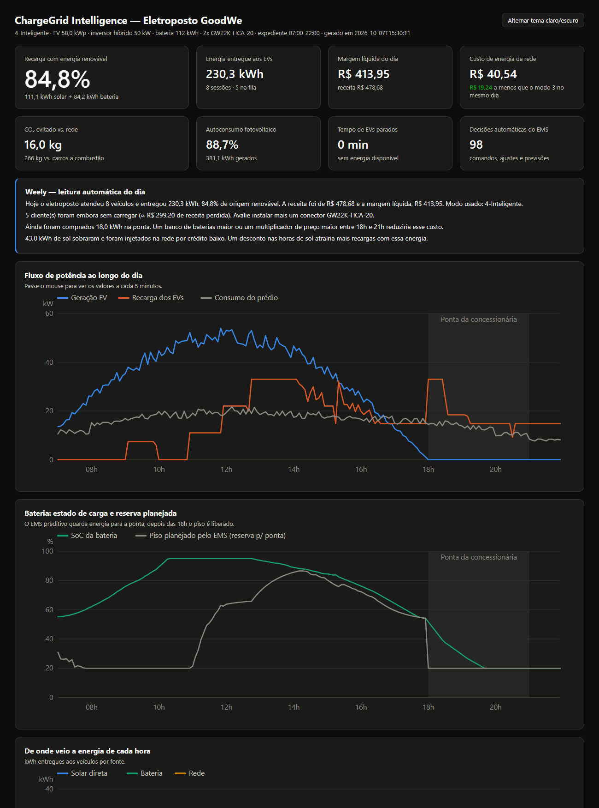
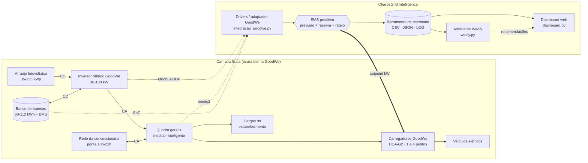
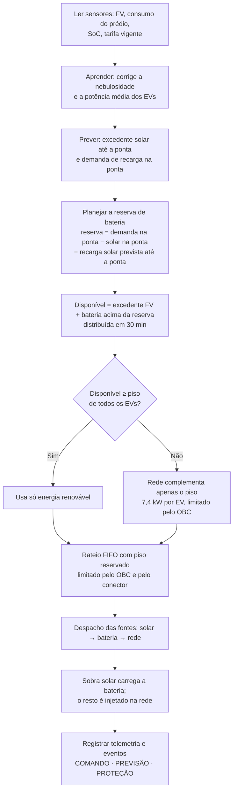
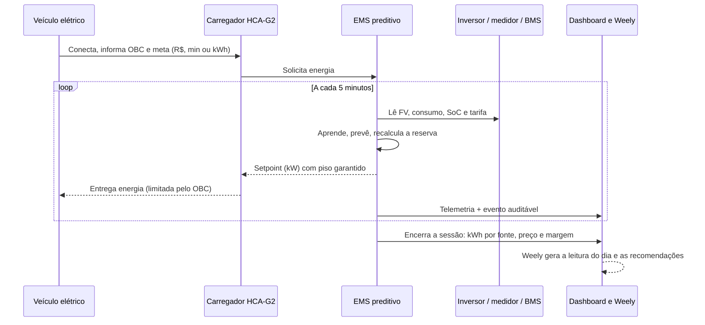
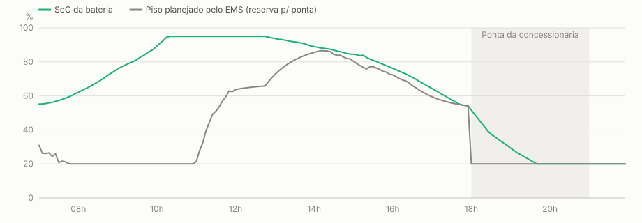
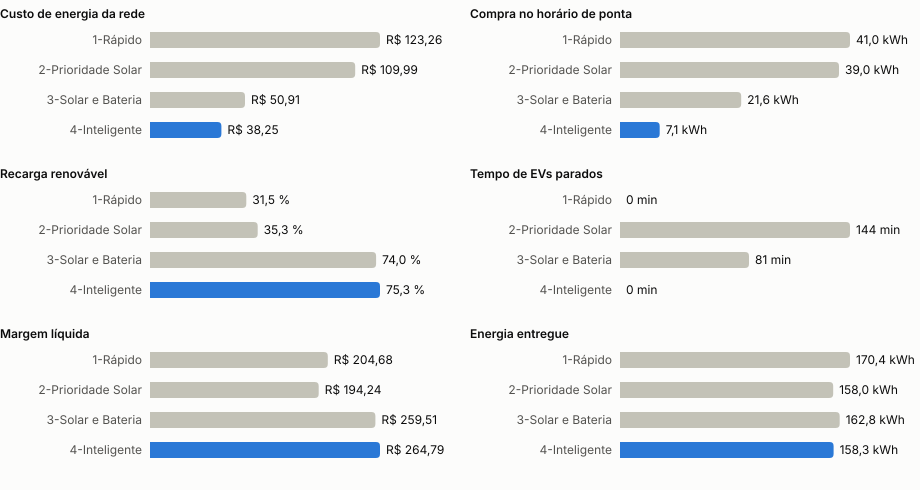
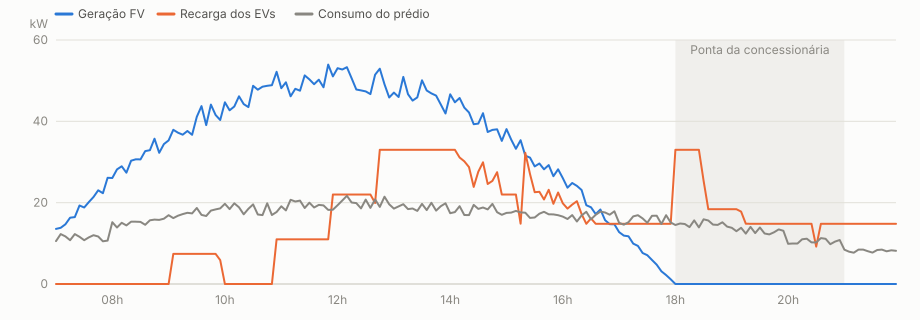
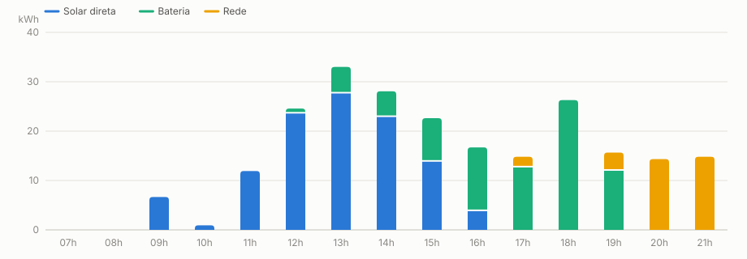

# ChargeGrid Intelligence — Eletroposto Inteligente GoodWe

**Solução final integrada de geração solar, armazenamento, recarga veicular e gestão inteligente de energia**
*Sprint 4 — Solução Final Integrada e Inovadora · Desafio GoodWe*



---

## Equipe

| Nome | RM |
|------|----|
| André Santos de Azevedo | RM572236 |
| Bruno Menezes Monegatto | RM570311 |
| Fabiana Yumi Rodrigues Nakagawa | RM571249 |
| Iago Neiva Gorrão | RM570234 |
| João Pedro Amorim Albuquerque | RM573342 |
| Kayky Araujo Silva | RM569535 |

---

## Sumário

1. [O problema e a proposta](#1-o-problema-e-a-proposta)
2. [O que mudou da Sprint 3 para a Sprint 4](#2-o-que-mudou-da-sprint-3-para-a-sprint-4)
3. [Arquitetura final e integração dos sistemas](#3-arquitetura-final-e-integração-dos-sistemas)
4. [O EMS preditivo (modo 4 — Inteligente)](#4-o-ems-preditivo-modo-4--inteligente)
5. [Como executar](#5-como-executar)
6. [Resultados quantitativos e qualitativos](#6-resultados-quantitativos-e-qualitativos)
7. [Justificativa de alinhamento ao desafio GoodWe e à disciplina](#7-justificativa-de-alinhamento-ao-desafio-goodwe-e-à-disciplina)
8. [Avaliação crítica: sustentabilidade e inovação](#8-avaliação-crítica-sustentabilidade-e-inovação)
9. [Referências, frameworks, ferramentas e sensores](#9-referências-frameworks-ferramentas-e-sensores)
10. [Estrutura do repositório](#10-estrutura-do-repositório)

---

## 1. O problema e a proposta

Um estabelecimento comercial (shopping, supermercado, posto) que instala carregadores de veículos
elétricos enfrenta três problemas ao mesmo tempo:

- **Custo:** a recarga coincide com o fim da tarde, exatamente no **horário de ponta** da
  concessionária (18h–21h), quando o kWh custa até 70% mais caro.
- **Sustentabilidade:** um carro elétrico carregado com energia comprada da rede no horário de ponta
  perde boa parte do seu apelo ambiental e econômico.
- **Experiência do cliente:** quando a energia renovável acaba, o carro fica parado no conector, e o
  cliente vai embora insatisfeito.

O **ChargeGrid Intelligence** integra, em um único sistema controlado por software, os equipamentos do
ecossistema GoodWe (arranjo fotovoltaico, **inversor híbrido**, **banco de baterias**, **medidor
inteligente** e **carregadores da Linha HCA-G2**) a um **controlador EMS preditivo**, que a cada
5 minutos decide quanta potência liberar para cada veículo e de qual fonte ela vem. Em volta dele
estão um **dashboard web**, uma **assistente virtual (Weely)** e um **adaptador de campo** para ler
inversores GoodWe reais.

---

## 2. O que mudou da Sprint 3 para a Sprint 4

| Sprint 3 (protótipo) | Sprint 4 (solução final) |
|---|---|
| 3 modos de carregamento com regras fixas | **Modo 4 — Inteligente**: EMS preditivo que prevê a geração solar, aprende a nebulosidade e a demanda em tempo real e guarda bateria para o horário de ponta |
| A bateria descarregava assim que o sol caía e acabava antes da ponta | **Reserva dinâmica de bateria** recalculada a cada 5 min, liberada às 18h |
| EVs podiam ficar até 30 min parados antes da retaguarda da rede | **Piso de potência garantido** por veículo: nenhum EV fica parado |
| Rateio FIFO puro | Rateio FIFO **com piso reservado** para todos os conectados |
| Resultado de 1 dia, 1 modo | **Comparativo dos 4 modos no mesmo dia** + **benchmark de N dias** com clima e demanda variáveis |
| Relatórios só em texto (console) | **Dashboard web** autocontido (modo claro/escuro, tooltips, tabelas) + gráficos SVG |
| IA Weely citada como trabalho futuro | **Assistente Weely funcional**: perguntas em linguagem natural e recomendações automáticas |
| Drivers apenas simulados | **Adaptador GoodWe** (`integracao_goodwe.py`) que lê um inversor real pela rede local |
| Sem testes | **21 testes automatizados** (`unittest`) |

Também corrigimos três defeitos do protótipo: o cálculo de autoconsumo fotovoltaico (ignorava o
consumo do prédio), um erro de ponto flutuante que pausava sessões com exatamente 4,2 kW disponíveis,
e alertas do BMS que eram registrados repetidamente.

---

## 3. Arquitetura final e integração dos sistemas

### 3.1 Diagrama de blocos



### 3.2 Ciclo de decisão do EMS (a cada 5 minutos)



### 3.3 Sequência de uma sessão de recarga



### 3.4 Como os módulos se conectam

| Módulo | Papel na integração |
|---|---|
| `Programa de Recarga GoodWe.py` | Núcleo: drivers dos equipamentos, configuração, precificação, **EMS preditivo**, motor de simulação, relatórios, comparativo e benchmark |
| `integracao_goodwe.py` | Lê um inversor híbrido GoodWe real (biblioteca open-source `goodwe`) e devolve as **mesmas grandezas** dos drivers simulados; se não houver inversor, cai para a leitura simulada |
| `dashboard.py` | Gera o dashboard HTML autocontido e os gráficos SVG a partir do `resumo_*.json` |
| `weely.py` | Assistente virtual: entende perguntas em português e responde com os dados reais do dia; gera recomendações |
| `resumo_*.json` | Contrato único entre os módulos: configuração, indicadores, sessões, telemetria, eventos, comparativo e benchmark (pronto para uma API ou para o SEMS Portal) |

O desenho em **drivers** é o que torna a solução "de campo": trocar `componente_fv_ler_geracao()` e
`componente_medidor_ler_consumo()` pela leitura de `integracao_goodwe.ler_medicoes(ip)` coloca o mesmo
EMS para operar um equipamento real, sem alterar o controlador, os relatórios, o dashboard ou a Weely.

---

## 4. O EMS preditivo (modo 4 — Inteligente)

O ponto fraco do modo "Solar e Bateria" da Sprint 3 aparece na curva diária: a bateria é usada assim
que o sol diminui (15h–17h) e **chega vazia ao horário de ponta**, quando a energia da rede custa
R$ 1,45/kWh em vez de R$ 0,85/kWh. O modo 4 resolve isso olhando para a frente:

1. **Previsão solar com aprendizado on-line.** Um modelo físico de céu claro (curva senoidal de
   irradiância) é corrigido por um fator de nebulosidade aprendido por **média móvel exponencial**
   entre a geração medida e a prevista (`ems_aprender`). No dia de referência, o EMS aprende uma
   nebulosidade de 11% a 15%, próxima dos 10% reais do cenário.
2. **Aprendizado da demanda.** O mesmo mecanismo aprende a potência média que os veículos estão
   realmente aceitando (limitada pelo OBC de cada um).
3. **Planejamento da reserva** (`ems_planejar_reserva`):
   `reserva = demanda prevista na ponta − solar previsto na ponta − recarga solar prevista até a ponta`.
   Recalculada a cada 5 minutos e registrada no log como evento `PREVISÃO`.
4. **Liberação suavizada.** Só a energia **acima da reserva** é oferecida aos carregadores, distribuída
   em uma janela de 30 minutos, o que evita o setpoint oscilando a cada ciclo (ruim para o hardware).
5. **Piso garantido.** Cada EV conectado recebe pelo menos 7,4 kW (ou o OBC dele, respeitando a
   modulação mínima de 4,2 kW do HCA-G2). A rede só complementa esse piso, fora da ponta, quando é barata.
6. **Às 18h a reserva é liberada** e a bateria assume a recarga durante a ponta.



*O SoC (verde) não cai abaixo do piso planejado pelo EMS (cinza) antes das 18h. Às 18h o piso cai para
o SoC mínimo de proteção (20%) e a bateria cobre a ponta.*

---

## 5. Como executar

Requisito: **Python 3.8+**, somente a biblioteca padrão. O adaptador de campo usa opcionalmente
`pip install goodwe`.

```bash
# demonstração completa usada no vídeo: modo 4, comparativo e benchmark de 30 dias
python "Programa de Recarga GoodWe.py" --auto --seed 22 --dias 30

# mesma execução, terminando em uma conversa com a assistente Weely
python "Programa de Recarga GoodWe.py" --auto --seed 22 --dias 30 --weely

# configuração interativa, passo a passo (escolha o modo 4 no menu)
python "Programa de Recarga GoodWe.py"

# assistente Weely sobre qualquer resumo exportado
python weely.py dados_exemplo/resumo_demo.json
python weely.py dados_exemplo/resumo_demo.json --pergunta "o que você recomenda?"

# regenerar o dashboard e os SVGs a partir de um resumo
python dashboard.py dados_exemplo/resumo_demo.json --svg docs/img

# leitura de um inversor GoodWe real na rede local (ou --simulado)
python integracao_goodwe.py --ip 192.168.1.50

# testes automatizados
python -m unittest discover -s tests -v
```

| Parâmetro | Função |
|-----------|--------|
| `--auto` | Perfil de demonstração, sem digitação (modo 4 por padrão) |
| `--seed N` | Semente aleatória: a execução é 100% reproduzível |
| `--modo 1-4` | Força um modo de carregamento |
| `--dias N` | Roda o benchmark de N dias comparando os 4 modos |
| `--weely` | Abre a assistente virtual ao final |
| `--rapido` | Remove as pausas de tela |
| `--saida PASTA` | Pasta dos arquivos gerados (padrão `saidas/`) |
| `--rotulo NOME` | Sufixo fixo dos arquivos (padrão: data e hora) |
| `--sem-exportar` | Não grava arquivos |

### Arquivos gerados a cada execução

| Arquivo | Conteúdo |
|---------|----------|
| `dashboard_*.html` | Dashboard web autocontido: KPIs, leitura da Weely, gráficos interativos, comparativo, sessões e log |
| `resumo_*.json` | Configuração, indicadores, sessões, telemetria, eventos, comparativo e benchmark |
| `sessoes_*.csv` | Uma linha por sessão: EV, SoC, meta, kWh por fonte, custo, preço, receita |
| `telemetria_*.csv` | Uma linha a cada 5 min: FV, consumo, recarga, rede, SoC, reserva, setpoint, tarifa, kWh por fonte |
| `eventos_*.log` | Todos os comandos, previsões e proteções emitidos pelo EMS, BMS e carregadores |
| `comparativo_modos_*.csv` | Indicadores dos 4 modos no mesmo dia |
| `benchmark_Ndias_*.csv` | Indicadores de cada modo em cada dia do benchmark |

A pasta [`dados_exemplo/`](dados_exemplo) contém a execução de referência completa
(`--auto --seed 22 --dias 30`), incluindo a saída do console em
[`execucao_demonstracao.txt`](dados_exemplo/execucao_demonstracao.txt) e o
[dashboard](dados_exemplo/dashboard_demo.html) (baixe e abra no navegador).

---

## 6. Resultados quantitativos e qualitativos

**Cenário de referência** (`--auto --seed 22`): usina de **58,0 kWp**, inversor híbrido de **50 kW**,
banco de **112 kWh**, **2 × GW22K-HCA-20**, expediente **07:00–22:00**, preço base **R$ 2,00/kWh**
com multiplicador **1,25** entre 18h e 21h, tarifa da concessionária R$ 0,85 (fora de ponta) e
R$ 1,45/kWh (ponta).

### 6.1 Resultado em 30 dias simulados (resultado principal)

Para medir o ganho real do EMS sem depender de um dia favorável, cada um dos 30 dias tem nebulosidade
(5% a 60%) e fila de veículos diferentes. Dentro de cada dia, **os quatro modos enfrentam exatamente o
mesmo clima e os mesmos veículos**; só a estratégia do EMS muda.

| Modo do EMS (média/dia) | Renovável | Rede (kWh) | Compra na ponta (kWh) | Custo da rede | Custo por kWh | Margem líquida | EVs parados |
|---|---:|---:|---:|---:|---:|---:|---:|
| 1 — Rápido | 31,5% | 116,1 | 41,0 | R$ 123,26 | R$ 0,73 | R$ 204,68 | 0 min |
| 2 — Prioridade Solar | 35,3% | 101,9 | 39,0 | R$ 109,99 | R$ 0,70 | R$ 194,24 | 144 min |
| 3 — Solar e Bateria (Sprint 3) | 74,0% | 44,7 | 21,6 | R$ 50,91 | R$ 0,30 | R$ 259,51 | 81 min |
| **4 — Inteligente (Sprint 4)** | **75,3%** | **40,0** | **7,1** | **R$ 38,25** | **R$ 0,24** | **R$ 264,79** | **0 min** |



**Ganho do modo 4 sobre o modo 3 (a melhor estratégia da Sprint 3):**

- **−67% de energia comprada no horário de ponta** (21,6 → 7,1 kWh/dia);
- **−25% no custo de energia da rede** (R$ 50,91 → R$ 38,25/dia);
- **zero minutos de veículos parados** (contra 81 min/dia);
- **+1,3 p.p. de recarga renovável** e **+R$ 5,28/dia de margem (≈ R$ 1.927/ano)**;
- margem igual ou maior em **24 dos 30 dias**.

**Ganho do modo 4 sobre uma operação convencional (modo 1, tudo da rede quando falta sol):**
**+43,8 p.p. de recarga renovável**, **−69% no custo da rede** e **+R$ 60,11/dia de margem
(≈ R$ 21.940/ano)** com o mesmo equipamento.

### 6.2 Dia de referência

| Modo (mesmo dia) | Renovável | Entregue | Compra na ponta | Custo da rede | Margem | EVs parados |
|---|---:|---:|---:|---:|---:|---:|
| 1 — Rápido | 44,2% | 250,1 kWh | 49,8 kWh | R$ 148,50 | R$ 334,23 | 0 min |
| 2 — Prioridade Solar | 48,1% | 230,3 kWh | 46,0 kWh | R$ 129,23 | R$ 312,82 | 90 min |
| 3 — Solar e Bateria | 80,5% | 242,7 kWh | 32,6 kWh | R$ 59,78 | R$ 407,49 | 55 min |
| **4 — Inteligente** | **84,8%** | 230,3 kWh | **18,0 kWh** | **R$ 40,54** | **R$ 413,95** | **0 min** |





Indicadores do dia no modo 4: **381,1 kWh** gerados, **230,3 kWh** entregues a 8 veículos
(111,1 kWh solar direta + 84,2 kWh bateria + 35,0 kWh rede), **autoconsumo FV de 88,7%**, receita de
**R$ 478,68**, custo de energia de **R$ 0,18 por kWh entregue**, **16,0 kg de CO₂ evitados** em relação
à rede e **266 kg** em relação a veículos a combustão. O EMS tomou **98 decisões automáticas**
registradas no log, como estas:

```
[11:50] EMS | PREVISÃO | Reserva de bateria para a ponta ajustada para 48 kWh (nebulosidade aprendida 14%, EV médio 10.0 kW)
[13:55] EMS | PREVISÃO | Reserva de bateria para a ponta ajustada para 73 kWh (nebulosidade aprendida 12%, EV médio 15.2 kW)
[18:00] EMS | PREVISÃO | Reserva liberada: início do horário de ponta, bateria assume a recarga
[18:00] EMS | COMANDO  | Setpoint dos carregadores ajustado de 14.8 kW para 33.0 kW
[19:40] BMS | PROTEÇÃO | Banco de baterias atingiu o SoC mínimo de proteção (20%) — descarga bloqueada
```

### 6.3 Resultados qualitativos

- **Decisões explicáveis:** cada mudança de potência tem um motivo escrito no log ("piso garantido",
  "reserva de 48 kWh para a ponta"). O operador consegue auditar por que o sistema agiu.
- **Interface para quem não é engenheiro:** o dashboard mostra primeiro o número que importa
  (percentual renovável) e a Weely traduz os dados em frases e ações ("5 clientes foram embora sem
  carregar, ≈ R$ 299 de receita perdida: avalie mais um conector").
- **Recomendações acionáveis:** no dia de referência, a Weely identificou 43 kWh de sol injetados na
  rede por crédito baixo e sugeriu desconto nas horas de sol para atrair demanda. Esse é o próximo
  ganho de autoconsumo.
- **Experiência do cliente:** a eliminação dos carros parados é o ganho mais perceptível para o
  usuário final.

---

## 7. Justificativa de alinhamento ao desafio GoodWe e à disciplina

### 7.1 Tecnologias GoodWe e por que cada uma foi escolhida

| Tecnologia GoodWe | Papel na solução | Por que é indispensável |
|---|---|---|
| **Inversor híbrido** (famílias ET/EH para trifásico comercial) | Soma FV, bateria e rede no mesmo barramento CA; é a fonte das leituras de FV, SoC e potência de rede | Sem o híbrido não existe o modo 3 nem o modo 4: a bateria não poderia ser despachada para os carregadores e a recarga cairia a zero a cada nuvem |
| **Banco de baterias GoodWe** (linha Lynx, gerido pelo BMS) | Armazena o excedente do meio-dia e o desloca para a ponta | É o "ativo" que o EMS preditivo otimiza; os limites de SoC (20%–95%) e de potência (0,5 C) do BMS estão modelados |
| **Medidor inteligente** no quadro geral | Mede o consumo do prédio para que o EMS ofereça aos carregadores só o que sobra | Garante a prioridade das cargas internas e evita ultrapassar a demanda contratada |
| **Carregadores Linha HCA-G2** (GW7K / GW11K / GW22K-HCA-20) | Executam o setpoint do EMS | Seus limites reais (mono/trifásico, potência máxima e modulação mínima de 1,4 ou 4,2 kW) definem quando o EMS precisa complementar com a rede |
| **SEMS Portal / monitoramento GoodWe** | Destino natural da telemetria exportada (`resumo_*.json`) | O formato JSON separado por indicadores, sessões e telemetria facilita a integração com a plataforma de monitoramento |
| **Comunicação local com o inversor** (via biblioteca open-source `goodwe`) | `integracao_goodwe.py` lê FV, consumo, SoC e potência de rede | Mostra o caminho do protótipo simulado para o equipamento real |

### 7.2 Como cada item resolve um ponto-chave do desafio

| Ponto-chave do desafio | Item da solução que resolve | Evidência |
|---|---|---|
| Geração, armazenamento e uso de energia renovável | Despacho solar → bateria → rede + reserva preditiva | 75,3% de recarga renovável na média de 30 dias; 84,8% no dia de referência |
| Monitoramento inteligente | Telemetria a cada 5 min, 98 eventos auditáveis, dashboard | `telemetria_demo.csv`, `eventos_demo.log`, `dashboard_demo.html` |
| Algoritmos inteligentes | Previsão solar + aprendizado on-line + planejamento da reserva | −67% de compra na ponta sobre o modo 3 |
| Automação avançada | O EMS decide setpoint, reserva, piso e retaguarda sem operador | 0 min de EVs parados; comandos `COMANDO`/`PREVISÃO`/`PROTEÇÃO` |
| Interface amigável e visualização de dados | Dashboard web com KPIs, gráficos interativos e modo escuro | `docs/img/dashboard.png` |
| Integração com assistente virtual | Weely: perguntas em português e recomendações | `python weely.py ... --pergunta "o que você recomenda?"` |
| Viabilidade técnica e econômica | Comparativo e benchmark com o mesmo clima e demanda | +R$ 21.940/ano de margem sobre a operação convencional |

### 7.3 Conexão com os conteúdos da disciplina

| Conteúdo | Onde aparece no projeto |
|----------|-------------------------|
| Entrada de dados e validação | Configuração interativa com laços de validação (`minutos_horario`, faixas de preço, modos) |
| Estruturas condicionais | Seleção de modo, proteções do BMS, piso garantido, retaguarda da rede, intenções da Weely |
| Estruturas de repetição | Laço temporal de 5 min, rateio entre sessões, fila de veículos, benchmark de N dias |
| Funções e modularização | Um driver por equipamento; EMS em funções (`ems_planejar_reserva`, `ems_aprender`, `ems_ratear_potencia`); módulos separados para dashboard, assistente e integração |
| Listas e dicionários | `telemetria`, `eventos`, `sessoes`, estado do EMS, tabela de intenções da Weely |
| Strings e formatação | Relatórios alinhados, números no padrão brasileiro, gráficos SVG gerados como texto |
| Manipulação de arquivos | Exportação CSV (`csv.DictWriter`), JSON (`json.dump`), LOG, HTML e SVG |
| Bibliotecas padrão | `random`, `math`, `datetime`, `argparse`, `copy`, `csv`, `json`, `html`, `unicodedata`, `asyncio`, `unittest` |
| Modelagem e simulação | Curva de irradiância, perfil de consumo, demanda estocástica reproduzível por semente |
| Algoritmos e IA | Média móvel exponencial (aprendizado on-line), previsão, planejamento por horizonte, reconhecimento de intenção |
| Testes de software | 21 testes: componentes, EMS, balanço de energia, reprodutibilidade, Weely e dashboard |

---

## 8. Avaliação crítica: sustentabilidade e inovação

### 8.1 Benefícios comprovados

- **Sustentabilidade:** sobre a operação convencional, a recarga passa de 31,5% para 75,3% renovável
  na média. O CO₂ evitado em relação à rede é modesto (≈ 9,7 kg/dia) porque a matriz brasileira já é
  limpa (fator SIN de 0,0817 kgCO₂/kWh). **O grande ganho ambiental é a substituição de veículos a
  combustão** (≈ 266 kg de CO₂/dia no dia de referência), e o sistema faz essa substituição
  **sem pressionar a rede no horário de ponta**, que no Brasil é atendido em boa parte por
  termelétricas acionadas na demanda máxima.
- **Eficiência:** o custo médio cai de R$ 0,73 para R$ 0,24 por kWh entregue. O autoconsumo FV fica
  acima de 97% na média de 30 dias.
- **Automação:** o operador só configura o eletroposto uma vez. Reserva, piso, retaguarda e proteções
  são decididos e registrados pelo EMS.
- **Inovação:** a estratégia de reserva preditiva usa só dados que o inversor e o medidor já fornecem
  e não exige hardware extra. É uma melhoria de software sobre o mesmo equipamento GoodWe.

### 8.2 Limitações e o que fazer com elas

- **Os dados são simulados.** Os perfis de geração, consumo e chegada de veículos são modelos
  estatísticos, não medições. O adaptador `integracao_goodwe.py` **não foi testado com um inversor
  físico** (a equipe não tem um disponível). Os nomes dos sensores seguem a documentação da biblioteca
  `goodwe` e precisam ser validados em campo.
- **O modo 4 entrega um pouco menos de energia que o modo 3** (158,3 contra 162,8 kWh/dia na média),
  porque segura bateria durante a tarde. A margem média ainda é maior porque a energia comprada é mais
  barata, mas, em 6 dos 30 dias, o modo 3 teve margem maior. As perdas relevantes ocorrem nos **dias de
  alta demanda**: ao limitar a potência da tarde para guardar bateria, o modo 4 atende menos energia
  (no dia 29 do benchmark: 220,5 kWh contra 265,9 kWh, com 2 veículos a mais não atendidos). Uma
  evolução natural é incluir a fila de espera no cálculo da reserva.
- **Cada dia começa com a bateria em 55%.** Não modelamos a transferência de carga entre dias nem a
  degradação da bateria por ciclo.
- **Tarifação simplificada:** só ponta e fora de ponta, sem demanda contratada, bandeiras tarifárias ou
  regras detalhadas de compensação de créditos (Lei 14.300/2022).
- **A Weely é baseada em regras.** Ela reconhece intenções por palavras-chave e calcula as respostas
  sobre os dados reais. Isso a torna previsível e auditável, mas ela não entende perguntas fora do
  vocabulário previsto.
- **O fator de CO₂ dos veículos a combustão é simplificado** (1,155 kgCO₂ por kWh equivalente de
  recarga) e serve como ordem de grandeza.

### 8.3 Próximos passos

- Validar `integracao_goodwe.py` em um inversor real e substituir os drivers simulados por ele.
- Publicar o `resumo_*.json` no SEMS Portal ou em uma API e manter histórico de vários dias.
- Usar previsão meteorológica externa no lugar do aprendizado só pela medição local.
- Conectar a Weely a um modelo de linguagem para perguntas abertas, mantendo os cálculos no código.
- Precificação dinâmica automática: desconto nas horas de sobra solar, sugerido hoje pela Weely.

---

## 9. Referências, frameworks, ferramentas e sensores

**Linguagem e bibliotecas:** Python 3 (biblioteca padrão: `argparse`, `asyncio`, `copy`, `csv`,
`datetime`, `html`, `json`, `math`, `os`, `random`, `unicodedata`, `unittest`); biblioteca
open-source `goodwe` (opcional, comunicação local com inversores GoodWe).

**Ferramentas:** Git e GitHub (versionamento), Mermaid (diagramas renderizados pelo GitHub), SVG e
HTML/CSS/JavaScript (dashboard sem dependências externas), navegador para visualização.

**Sensores e grandezas modelados:**

| Sensor / fonte | Grandeza | Uso no EMS |
|---|---|---|
| Inversor híbrido (string FV) | Potência fotovoltaica (kW) | Excedente solar, aprendizado de nebulosidade |
| Medidor inteligente (quadro geral) | Consumo do prédio (kW), potência de rede | Prioridade das cargas internas |
| BMS do banco de baterias | Estado de carga (SoC, %), potência de carga/descarga | Reserva para a ponta, proteções de SoC |
| Carregador HCA-G2 | Potência entregue, estado da sessão | Rateio, faturamento |
| Veículo (via carregador) | OBC (kW), SoC, meta de recarga | Limite de potência por veículo |
| Tarifa da concessionária | R$/kWh por horário | Custo, decisão de reserva |

**Referências:**

- GoodWe — catálogo de inversores híbridos, baterias e carregadores da Linha HCA-G2: <https://www.goodwe.com>
- GoodWe SEMS Portal (monitoramento): <https://www.semsportal.com>
- Biblioteca `goodwe` (Python, open-source): <https://github.com/marcelblijleven/goodwe>
- MCTI — Fatores de emissão de CO₂ do Sistema Interligado Nacional: <https://www.gov.br/mcti>
- ANEEL — Tarifa branca e postos tarifários (ponta / fora de ponta): <https://www.gov.br/aneel>
- Lei nº 14.300/2022 — Marco legal da micro e minigeração distribuída.

---

## 10. Estrutura do repositório

```
├── Programa de Recarga GoodWe.py   núcleo: drivers, EMS preditivo, simulação, relatórios, comparativo
├── dashboard.py                    dashboard HTML + gráficos SVG
├── weely.py                        assistente virtual Weely
├── integracao_goodwe.py            adaptador de campo para inversores GoodWe
├── tests/test_chargegrid.py        21 testes automatizados
├── dados_exemplo/                  execução de referência completa (--auto --seed 22 --dias 30)
│   ├── dashboard_demo.html
│   ├── resumo_demo.json · telemetria_demo.csv · sessoes_demo.csv · eventos_demo.log
│   ├── comparativo_modos_demo.csv · benchmark_30dias_demo.csv
│   └── execucao_demonstracao.txt
└── docs/
    ├── img/                        dashboard.png e gráficos SVG usados neste README
    └── roteiro_video.md            roteiro do vídeo técnico (5 min)
```
